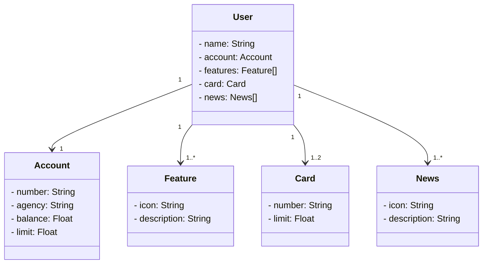

# Santander Bootcamp


## Diagrama de classes

## Railway

```properties
spring_profiles_active=prod
PROD_DB_HOST= containers-us-west-92.railway.app
PROD_DB_PORT= 6281
PROD_DB_NAME=railway
PROD_DB_PASSWORD= EY3tgIYd8DAguaiGs2FH
PROD_DB_USERNAME=postgres

```